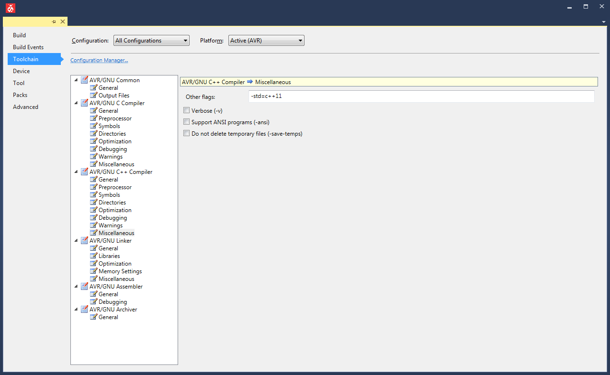

# LCD8448

LCD Display Library for the 8448 LCD Display (Nokia 5110 display)

It's based on de Library from Lauren from DFRobot / "LCD4884" version 0.3

See [LCD8448](https://github.com/RedCali/LCD8448.git) for more detailed information on how to use LCD8448

## Includ the Library in your project

To include the Library in ypur project you need to install it or take a copy in your project.  
Copy the `LCD8448_Config.h` file beside your `main.cpp` to overwrite the default configuration and adjust it to the projects needs.

```cpp
// Include LCD definitions - Overwrite the Library LCD Config File
#include "LCD8448_Config.h"
// Include LCD Library
#include <LCD8448.h>
```

## Using with diffrent IDE'S

### PlatformIO

To include the Library in your PlatformIO project, you need simply to add it to your `platformio.ini`:

```yaml
lib_deps =
    https://github.com/RedCali/LCD8448.git
```

### Atmel Studio / Microchip Studio

For the use of this Library, C++11 support needs to be enabled



## Generating the Image / Symbol Arrays

To generate the Symbol array [Image2Bitmap](https://github.com/FoxExe/Image2Bitmap) is used.

A copy and extended Version can be found at [RedCali@Git/Image2Bitmap](https://github.com/RedCali/Image2Bitmap)
